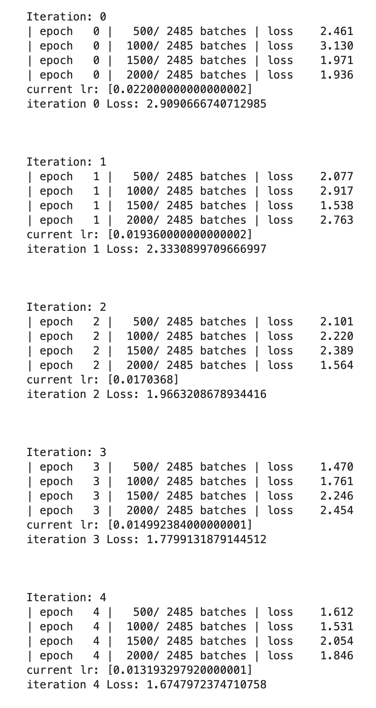
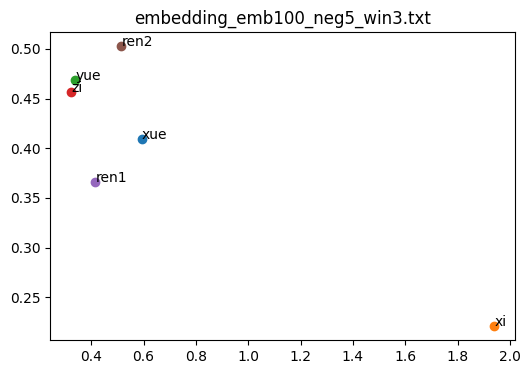
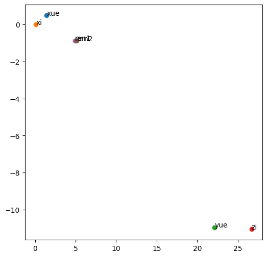

## CS310 NLP Assignment 2 -- Word2Vec

钟志源 12110517

### Step 3

Example loss change:

Usually when the epoch is around 10-15, the loss stops decreasing significantly. So I set the epoch to 15.

### Step 5

Comparison with LSA embedding

Embedding from skipgram model:

Embedding from LSA model:

The `子` and `曰` are close to each other in skipgram and lsa. But the `学` and `习` are distant in skipgram, while close in lsa. Word meaning is pretty tricky:)